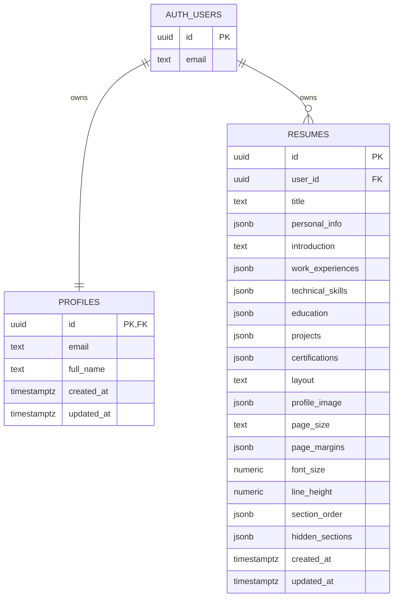

# ATS Resume Builder ERD

## Notes

- `auth.users` is managed by Supabase Auth.
- `profiles.id` is a 1:1 extension of `auth.users.id`.
- `resumes.user_id` scopes every resume to exactly one account.
- Row Level Security ensures users can only read/write/delete their own profile and resumes.
- Resume sections are stored as JSONB arrays because the app edits the whole resume as one document and autosaves frequently.
- Guest users do not write to Supabase and do not use localStorage; their resumes live only in browser memory for the current page session.
